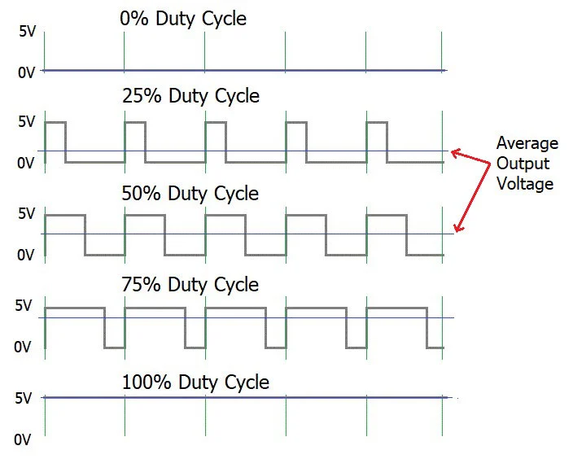

# Arduino Basics

## Goal
Build a strong foundation in Arduino programming and hardware interaction.

## Topics Covered
- Introduction to Arduino
- Arduino IDE
- setup() and loop()
- Digital Input/Output
- Analog Input

**Arduino Uno Pinout**

[Arduino Pinout](./image/Arduino%20Uno%20Pinout.jpg)

**PWM Signal Example**

[PWM Diagram](./image/Pulse-Width-Modulation.webp)

## Current Progress
In Progress

