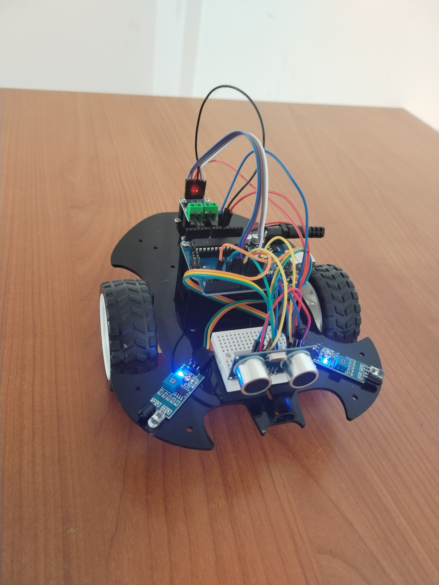

# Smart Car (Arduino)

## 📌 Description
An autonomous + remote-controlled smart car built using Arduino.  
It detects obstacles using ultrasonic and IR sensors and can also be controlled via IR remote.

---

## 📸 Robot

---

## 🚀 Features
- Obstacle avoidance (Ultrasonic + IR sensors)  
- IR remote control (manual driving)  
- Forward, backward, left, right movement  
- Adjustable speed  
- Hybrid control (auto + manual)  

---

## 🧰 Components
- Arduino Uno  
- Motor Driver  
- DC Motors (2WD)  
- IR Receiver + Remote  
- Ultrasonic Sensor (HC-SR04)  
- IR Sensors (Left & Right)  
- 9V Battery  

---

## 🔌 Pin Configuration

### Motor Driver
- Pin 5, 6 → Motor A  
- Pin 9, 10 → Motor B  

### IR Receiver
- Pin 11  

### Ultrasonic Sensor
- Trig → Pin 7  
- Echo → Pin 4  

### IR Sensors
- Left → Pin 8  
- Right → Pin 2  

---

## ⚙️ System Behavior
- Obstacle (front) → Stop and turn  
- Obstacle (left) → Turn right  
- Obstacle (right) → Turn left  

---

## 🎮 Demo

▶️ Obstacle avoidance in action  
Watch on YouTube: https://youtu.be/BQObJWiTIyM

▶️ IR remote control demo  
Watch on YouTube: https://youtu.be/699cxRvl1Wk

---

## ⚠️ Limitations
- 9V battery is not ideal for DC motors  
- Motor power may be unbalanced  
- Robot may drift or rotate slightly  

---

## 💻 Code
👉 You can see the full code here:  
[smart_car.ino](./smart_car.ino)
